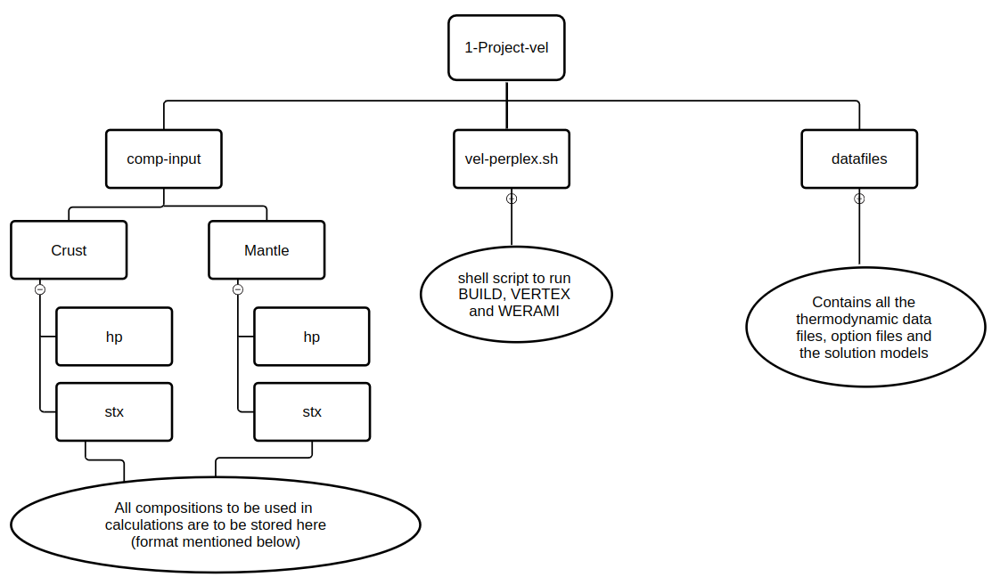

## Perple_X-CGL

[vel-perplex.sh](https://github.com/AmitavaDutta/Perple_X-CGL/blob/main/1-Project-Vel/vel-perplex.sh) is a shell script to execute BUILD, VERTEX, WERAMI functions of [Perple_X ([Connolly 2005](#Connolly_2005), [Connolly 2009](#Connolly_2009)](https://www.perplex.ethz.ch/) automatically.

#### **The format of the directory set-up to be followed as shown here for easier workflow according to the script.** Any changes here needs to be reflected on the script as well.

Here, [1-Project-Vel](https://github.com/AmitavaDutta/Perple_X-CGL/tree/main/1-Project-Vel) is the main directory and [datafiles](https://github.com/AmitavaDutta/Perple_X-CGL/tree/main/1-Project-Vel/datafiles) & [comp-input](https://github.com/AmitavaDutta/Perple_X-CGL/tree/main/1-Project-Vel/comp-input) are the sub-directories and [vel-perplex.sh](https://github.com/AmitavaDutta/Perple_X-CGL/blob/main/1-Project-Vel/vel-perplex.sh) is the main script.

### Format for the composition file
```
Na2O
MgO
Al2O3
SiO2
K2O
CaO
FeO
3.21 8.73 15.48 48.3 1.21 9.52 8.87
```
Here the directory name for the composition files are to be followed as per the thermodynamic datfile. **The names are case sensitive**. The script is set up such that it takes the names till the line before it finds a line starting with a numeric character which are the proportion of the components.

To run the script make it an executable and then
```
./vel-perplex.sh
```
### Promts for the user input
```
# Prompt the user for the project name
read -p "Enter a name for the project (this name shall contain short info about themodynamic datafile and the composition): " project_name
echo "Your project is ${project_name}.dat"
echo -e "\n"
# Set a default value for the thermodynamic data file if the user presses enter
echo "Default Thermodynamic data file is hp633ver.dat"
echo "Some available examples of thermodynamic data files are: " #hp02ver.dat, hp633ver.dat, stx21ver.dat and stx24ver.dat
ls datafiles/hp*
ls datafiles/stx*
read -p "Enter the thermodynamic data file name (press Enter for default): " thermo_datafile
thermo_datafile=${thermo_datafile:-hp633ver.dat}

# Check if the thermodynamic data file exists in the /datafiles directory
if [ ! -f "$datafiles_dir/$thermo_datafile" ]; then
    echo "Error: Thermodynamic data file $thermo_datafile not found in $datafiles_dir."
    exit 1
fi
echo "Thermodynamic data file is $thermo_datafile"
echo -e "\n"
# Set a default value for the computational option file if the user presses enter
echo "Default Computational option file is perplex_option.dat"
echo "Some available examples of computational option files are: " #hp02ver.dat, hp633ver.dat, stx21ver.dat and stx24ver.dat
ls datafiles/perplex_option*
read -p "Enter the Computational option file name (press Enter for default): " optn_file
optn_file=${optn_file:-perplex_option.dat}

# Check if the computational option file exists in the /datafiles directory
if [ ! -f "$datafiles_dir/$optn_file" ]; then
    echo "Error: Computational option file $optn_file not found in $datafiles_dir."
    exit 1
fi
echo "Computational option file is $optn_file"
echo -e "\n"
# Set a default value for the solution model file if the user presses enter
echo "Default Solution model file is solution_model.dat"
echo "Available Solution model files are: " #solution_model.dat, stx21_solution_model.dat and stx24_solution_model.dat
ls datafiles/*solution*
read -p "Enter the solution model file name (press Enter for default): " soln_mod
soln_mod=${soln_mod:-solution_model.dat}

# Check if the solution model file exists in the /datafiles directory
if [ ! -f "$datafiles_dir/$soln_mod" ]; then
    echo "Error: Solution model file $soln_mod not found in $datafiles_dir."
    exit 1
fi
echo "Solution Model is $soln_mod"
echo -e "\n"

#Composition Name
#echo "Currently available Compositions are:"
#ls comp-input/
#read -p "Enter a name of the Composition: " composition_name
# Check if the solution model file exists in the /datafiles directory
#composition_file="$comp_files/$composition_name"

#!/bin/bash

# Ask the user whether they want Crust or Mantle
read -p "Do you want to calculate for Crust or Mantle? " layer_type

# Set the comp_files directory based on the user's choice
if [ "$layer_type" == "Crust" ]; then
    comp_files="comp-input/Crust"
elif [ "$layer_type" == "Mantle" ]; then
    comp_files="comp-input/Mantle"
else
    echo "Invalid choice! Please select either Crust or Mantle."
    exit 1
fi

# Extract the prefix from the thermo_datafile
#thermo_datafile="hp02ver.dat" # Example; replace with actual input
prefix=$(echo "$thermo_datafile" | sed -E 's/[0-9]+.*//')

# Now, display available compositions based on the extracted prefix and layer
echo "Currently available Compositions for the selected thermodynamics data file are:"
ls "$comp_files/$prefix"

# Ask for the composition name
read -p "Enter a name of the Composition: " composition_name

# Construct the path to the composition file
composition_file="$comp_files/$prefix/$composition_name"

# Check if the composition file exists
if [ -f "$composition_file" ]; then
    echo "Composition file found: $composition_file"
else
    echo "Composition file not found: $composition_file"
fi


# Initialize arrays for components and mass amounts
components=()
mass_amounts=""

# Check if the composition file exists
if [[ -f "$composition_file" ]]; then
    # Read the components (all lines except the last one)
    while IFS= read -r line; do
        # Add line to components array until the last line
        components+=("$line")  # Add each line to the components array
    done < <(head -n -1 "$composition_file")  # Read all but the last line

    # Read the mass amounts from the last line
    read -r mass_amounts < <(tail -n 1 "$composition_file")

    # Check if mass amounts are not empty
    if [[ -z "$mass_amounts" ]]; then
        echo "Error: No mass amounts found in $composition_file."
        exit 1
    fi
else
    echo "Error: Composition file $composition_file not found in $comp_files."
    exit 1
fi

echo "Composition is $composition_name"
```
The directories are arranged based on the script design. **Any changes in directory path/file path needs to be reflected here.*

### BUILD Inputs
```
{
    echo "$project_name"                       # Project name
    echo "$datafiles_dir/$thermo_datafile"     # Thermodynamic data file
    echo "$datafiles_dir/$optn_file"           # Computational option file
    echo "n"                                   # Transform components (Y/N)
    echo "2"                                   # Computational mode (2d grid)
    echo "n"                                   # Calculations with saturated fluids (Y/N)    
    echo "n"                                   # Calculations with saturated components (Y/N)
    echo "n"                                   # Use chemical potentials, activities, fugacities (Y/N)

    # Loop through the components array and echo each component
    for component in "${components[@]}"; do
        echo "$component"                      # Thermodynamic components
    done

    echo ""                                    # End of thermodynamic components selection
    echo "n"                                   # Make P dependent on T (Y/N)
    echo "2"                                   # Select x-axis variable (2 for T(K))
    echo "273"                                 # Minimum T(K)
    echo "2000"                                # Maximum T(K)
    echo "15"                                  # Minimum P(bar)
    echo "150000"                              # Maximum P(bar)
    echo "y"                                   # Specify component amounts by mass (Y/N)
    echo "$mass_amounts"                       # Mass amounts for components
    echo "y"                                   # Output a print file (Y/N)
    echo "y"                                   # Exclude pure/endmember phases (Y/N)
    echo "n"                                   # Do you want to be prompted for phases (Y/N)? 
    echo "ne"				       #  Enter names, left justified, 1 per line, press <enter> to finish: 
    echo "ab"				       #  Enter names, left justified, 1 per line, press <enter> to finish: 
    echo "san"				       #  Enter names, left justified, 1 per line, press <enter> to finish: 
    echo "lc"				       #  Enter names, left justified, 1 per line, press <enter> to finish: 
    echo "sil8L"			       #  Enter names, left justified, 1 per line, press <enter> to finish: 
    echo "qjL"			               #  Enter names, left justified, 1 per line, press <enter> to finish: 
    echo "qHL"	                               #  Enter names, left justified, 1 per line, press <enter> to finish: 
    echo "q8L"				       #  Enter names, left justified, 1 per line, press <enter> to finish: 
    echo "crst"			               #  Enter names, left justified, 1 per line, press <enter> to finish: 
    echo "trd"				       #  Enter names, left justified, 1 per line, press <enter> to finish: 
    echo "qL"				       #  Enter names, left justified, 1 per line, press <enter> to finish: 
    echo "q"		                       #  Enter names, left justified, 1 per line, press <enter> to finish: 
    echo "kjdTH"		               #  Enter names, left justified, 1 per line, press <enter> to finish: 
    echo "kjdh"                                #  Enter names, left justified, 1 per line, press <enter> to finish: 
    echo "qTHL"	                               #  Enter names, left justified, 1 per line, press <enter> to finish: 
    echo "qWL"	                      	       #  Enter names, left justified, 1 per line, press <enter> to finish: 
    echo "anL"	                       	       #  Enter names, left justified, 1 per line, press <enter> to finish: 
    echo ""
    echo "y"                                   # Include solution models (Y/N)
    echo "$datafiles_dir/$soln_mod"            # Solution model file
    echo "O(HP)" 			       # Solution Model Phases
    echo "Sp(HP)"  			       # Solution Model Phases
    echo "Gt(HP)"  			       # Solution Model Phases
    echo "Opx(HP)"  			       # Solution Model Phases
    #echo "Cpx(HP)" 			       # Solution Model Phases
    echo "Pl(h)" 			       # Solution Model Phases
    echo "Wad" 			               # Solution Model Phases
    #echo "San(TH)"  			       # Solution Model Phases
    #echo "C2_c(jca)"  			       # Solution Model Phases    
    #echo "GlTrTsPg" 			       # Solution Model Phases
    #echo "B" 	         		       # Solution Model Phases
    #echo "Chl(HP)" 			       # Solution Model Phases
    #echo "KN-Phen" 			       # Solution Model Phases
    #echo "T" 			               # Solution Model Phases
    #echo "A-phase" 			       # Solution Model Phases
    #echo "Atg" 			       # Solution Model Phases
    echo ""                                    # End of solution model selection
    echo "${project_name}"                     # Calculation title (same as project name)
} > "$input_file"
```

All input parameters are based on wrok preferences.
**Suggestion: Run the build manually before executing the code. The input prompts changes based on the requiremnts of the job**

### WERAMI Inputs
```
input_file="werami_input.txt"	    # For all the input and their functions check https://www.perplex.ethz.ch/perplex_66_seismic_velocity.html#top
{
    echo "$project_name"    # Project name
    echo "2"                # Operational mode: properties on a 2d grid
    echo "38"               # Select a property: multiple property output
    echo "1"                # Properties of the system
    echo "n"                # Include fluid in computation of aggregate (or modal) properties (y/n)?
    echo "2"                # Property: Density (kg/m3)
    echo "13"               # Property: P-wave velocity (Vp, km/s)
    echo "14"               # Property: S-wave velocity (Vs, km/s)    
    echo "3"                # Property: Specific heat capacity (J/K/m3)
    echo "19"               # Property: Heat Capacity (J/K/kg)
    echo "27"               # Property: P-wave velocity T derivative (km/s/K)
    echo "28"               # Property: S-wave velocity T derivative (km/s/K)
    echo "32"               # Property: P-wave velocity P derivative (km/s/bar)
    echo "33"               # Property: S-wave velocity P derivative (km/s/bar)
    echo "0"                # End property selection
    echo "n"                # Change default variable range: No
    echo "4"                # Grid resolution: 313 x 313 nodes
    echo "y"                # Continue with operation
    echo "0"                # End werami
} > "$input_file"
```

All input parameters are based on wrok preferences.
**Suggestion: Run the build manually before executing the code. The input prompts changes based on the requiremnts of the job**


The script is designed such a way all the outputs will be visble in a directory creadted during execution named after the project name as per user input and all the .tab files containig the metadata and the various physical properties based varying with Pressure and Temperature is also placed onto another directory called [output-files](https://github.com/AmitavaDutta/Perple_X-CGL/tree/main/1-Project-Vel/output-files)

### Promt for the metadata
```
# Extract the composition data (lines 29-34)
comp_data=$(sed -n '29,35p' "${project_name}.dat" | awk '{print $1, $3}')

# Extract T and P ranges (lines 65-66)
t_p_range=$(sed -n '81,82p' "${project_name}.dat" | awk '{print $1, $2}')

# Format composition data (columns 1 and 3)
comp_elements=$(echo "$comp_data" | awk '{printf "%s\t", $1}')  # Elements separated by tab
comp_amounts=$(echo "$comp_data" | awk '{printf "%.2f\t", $2}') # Amounts with two decimal places

# Format T(K) and P(bar) range
T_min=$(echo "$t_p_range" | awk 'NR==2 {print $2}')
T_max=$(echo "$t_p_range" | awk 'NR==1 {print $2}')
P_min=$(echo "$t_p_range" | awk 'NR==2 {print $1}')
P_max=$(echo "$t_p_range" | awk 'NR==1 {print $1}')

# Get the current date
current_date=$(date)
```

Here make changes as per the first project file (.dat) file created after running the build. The temperature and pressure ranges need to be extracted from whci line it is on the project file.
