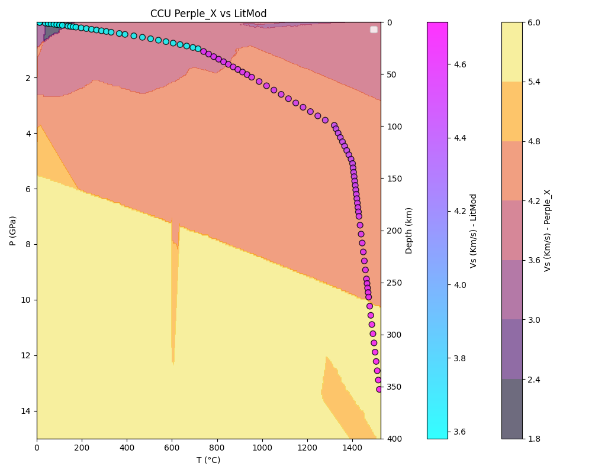
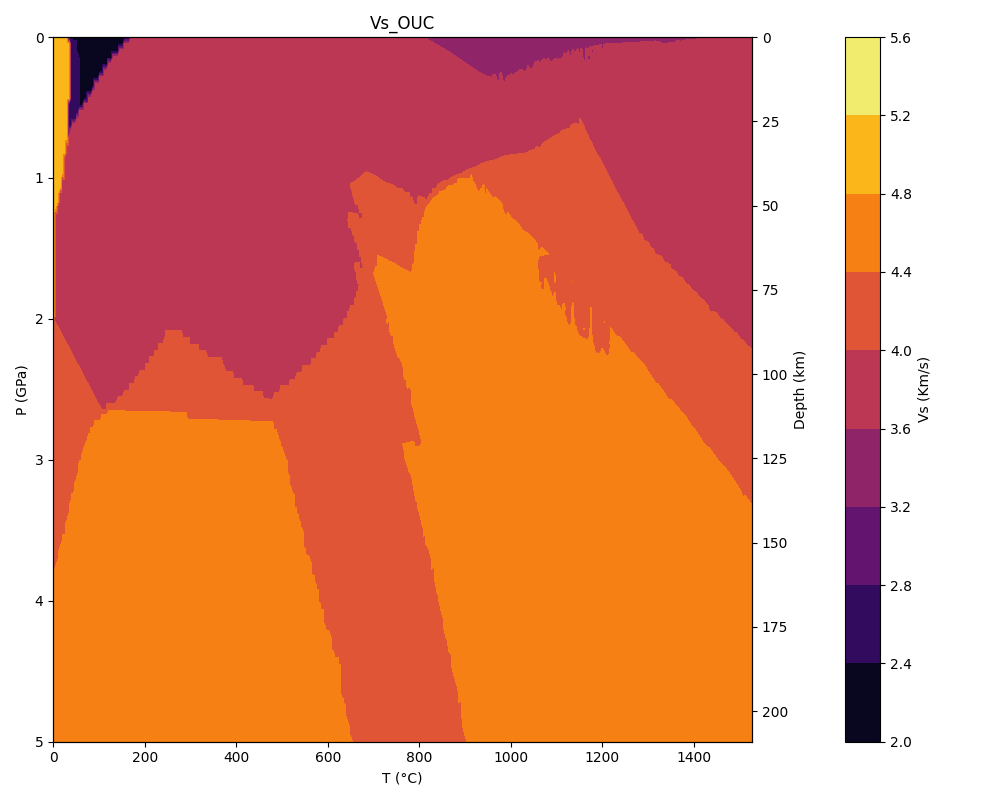
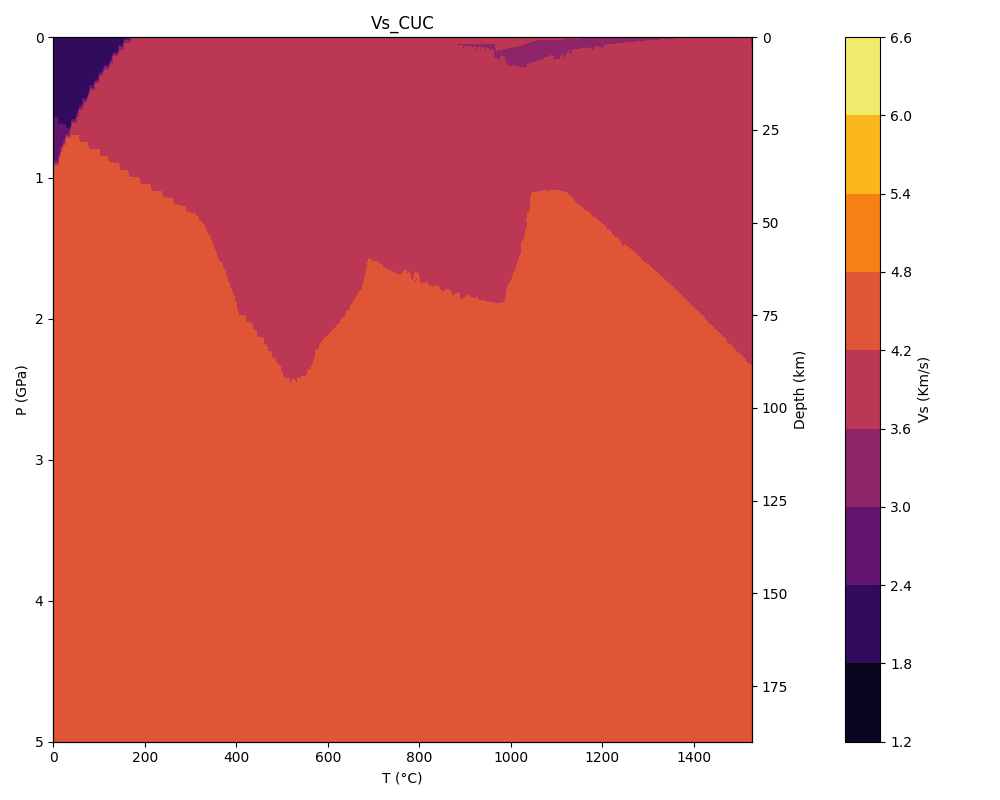

# Perple_X-CGL

Directory Scripts contain the bash scripts for executing build and werami automatically
It also has some python programmes to plot the Vp, Vs, Rho wtr P and T

Directory 1-Sublithospheric-Mantle-Stx contains all the executed files using Stixrude 21

Directory 2-Crust contains all the executed files for Crust using Holland and Powell 2008

### **For Continental Crust here is a plot of LitMod data onto a Perple_X data where melt is present as Saturated Fluid in Equilibrium with the Bulk Composition**

#### **Two examples with melt in the system**

### **Considering Melt in as Saturated Fluid in Equilibrium with the Bulk Composition**

### **Considering Melt in Bulk Composition**

